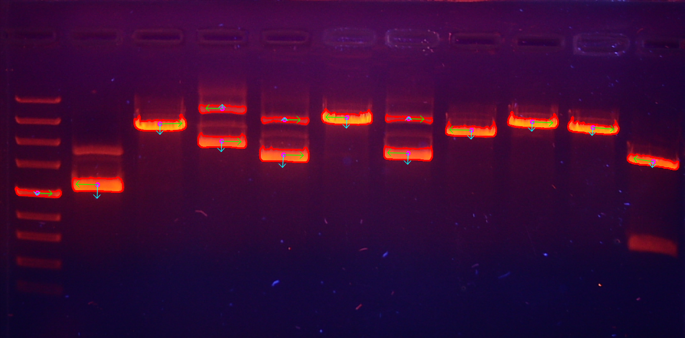

# DNA Imaging

## Setup

Dependencies: `numpy, opencv-python`.

These can be installed e.g. using
a package manager like `pip` or within an IDE.

## Running

```
python pca.py images/gel1.png
```

## Sample output



## Tutorials

OpenCV:

* https://docs.opencv.org/3.4/d1/dee/tutorial_introduction_to_pca.html
(Note that this is in C++. The code has been converted into Python in `pca.py`.)

