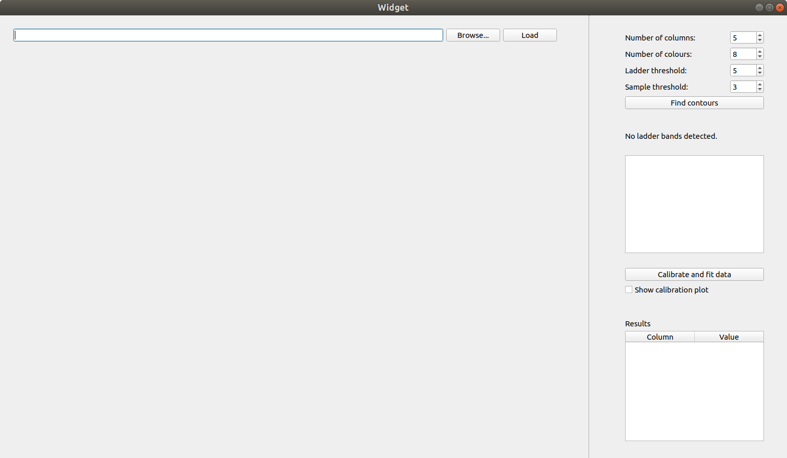
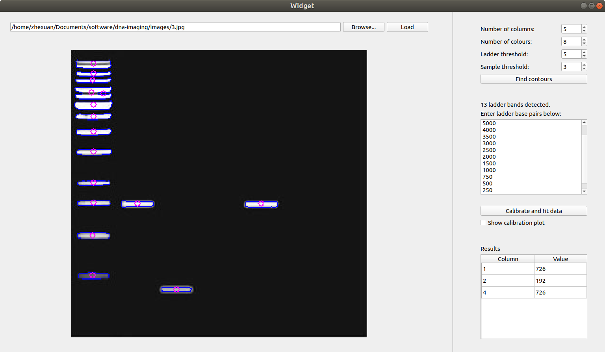

# DNA Imaging

## Setup

This project runs mainly on Python. It uses the following packages:

* OpenCV for image processing
* NumPy for numerical processing
* Matplotlib for plotting
* PySide2 for the graphical user interface

Note: PySide2 (aka Qt for Python) is the ofifcial Python wrapper for Qt. The GUI runs on Qt.

The project has been tested on **Python 3** and may not work on Python 2.
These packages can be installed e.g. using `pip3`. On Ubuntu:

```
sudo apt install python3-pip
sudo pip3 install opencv-python numpy matplotlib PySide2
```

### Raspberry Pi

Raspberry Pi runs on Raspbian which is based on Debian. Installation is not as straightfoward as some packages are not easily available. The required packages have been compiled in the file `install.sh`:

```
chmod +x install.sh
sudo ./install.sh
```

Then, in the Raspberry Pi's `~/.bashrc` file, add the following line

```
export LD_PRELOAD=/usr/lib/arm-linux-gnueabihf/libatomic.so.1
```

and run

```
source ~/.bashrc
```

to reload bash. This has been tested on Raspbian GNU/Linux 10 (buster).

#### Raspberry Pi Camera

The silver connectors should face the HDMI port. First enable the camera using

```
sudo raspi-config
```

To test whether the camera is correctly connected one can run `vcgencmd get_camera`.
To take a test image one can run `raspistill -o test.jpg`.

## SSH to Raspberry Pi

When connecting over e.g. Ubuntu use X forwarding using the `-X` flag. 

## Running

```
python3 main.py
```

A window such as the following will appear:



Choose the desired image by clicking browse (followed by load). Choose the desired parameters on the right and click
the 'Find contours' button. The image will be updated and the program will display the number of bands detected in the
ladder region. The user needs to manually key in the base pair values for the ladder region, ensuring that the number
of values keyed in matches the number of bands detected. Then click the 'Calibrate and fit data' button and the results
will be updated in the table below.

Sample output after performing all the above steps:



## Explanation

The code first performs colour quantisation followed by binary thresholding.
It then finds contours and performs PCA analysis to obtain the centres of each contour region.
It assumes that the reference ladder is on the left.
After collecting the calibration data it tries to obtain a line of best fit on a semilog graph.

## Tutorials

OpenCV:

* PCA: https://docs.opencv.org/3.4/d1/dee/tutorial_introduction_to_pca.html
* Colour quantisation: https://www.pyimagesearch.com/2014/07/07/color-quantization-opencv-using-k-means-clustering/

