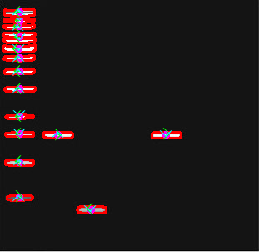
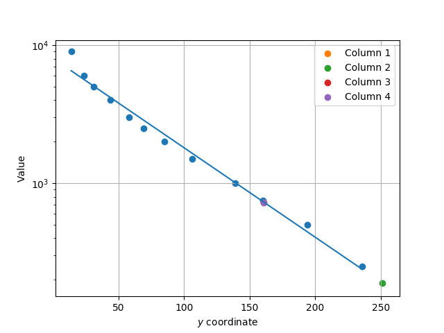

# DNA Imaging

## Setup

Python dependencies: `opencv-python, numpy, matplotlib`.

These can be installed e.g. using
a package manager like `pip` or within an IDE.

## Running

```
python main.py images/3.jpg
```

## Explanation

The code first performs colour quantisation followed by binary thresholding.
It then finds contours and performs PCA analysis to obtain the centres of each contour region.

Currently the parameters `NUM_COLOURS` and `THRESHOLD` in `processing.py` need to be tuned manually to get the best
possible output.

The program then separates the contours into columns. However currently one needs to
manually pass `NUM_COLUMNS` as a parameter in `main.py` to get a good result.
It assumes that the reference ladder is on the left and prompts the user for calibration
data such as the following, if there are sufficient data points:

```text
Enter value for reference point at y coordinate 14:
```

After collecting the reference data it plots a line of best fit on a semilog graph, and
plots the rest of the data on the line.


## Sample output

Finding contours:



Plotting the data:



## Tutorials

OpenCV:

* PCA: https://docs.opencv.org/3.4/d1/dee/tutorial_introduction_to_pca.html
* Colour quantisation: https://www.pyimagesearch.com/2014/07/07/color-quantization-opencv-using-k-means-clustering/

